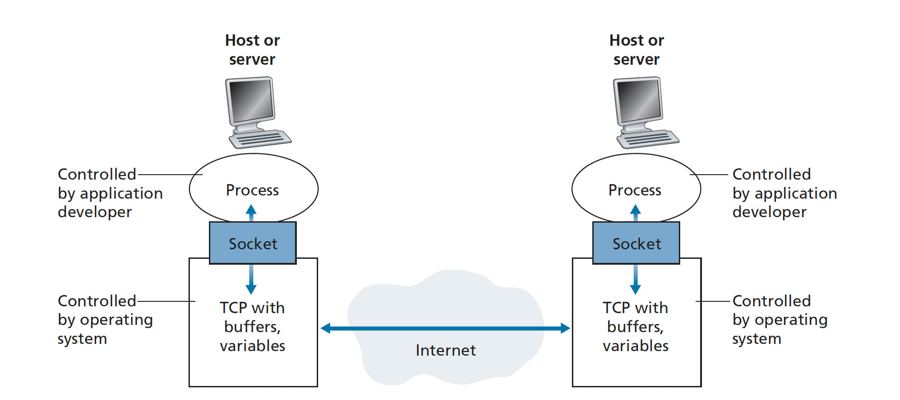
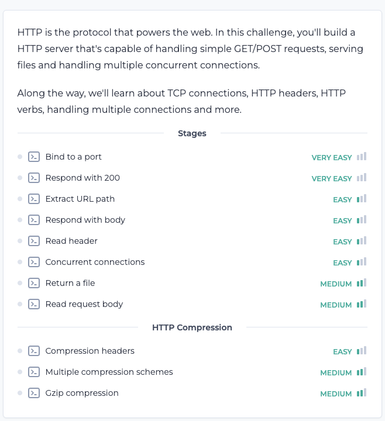

# simple_http
simple http server

C lang

## Background knowledge
1. How to use TCP port
	•	socket() – Creates a network socket.
	•	bind() – Associates the socket with an IP and port.
	•	listen() – Puts the socket in listening mode.
	•	accept() – Accepts incoming client connections.
	•	recv() / send() – Reads/writes raw data over the network.

Note:
1. htons